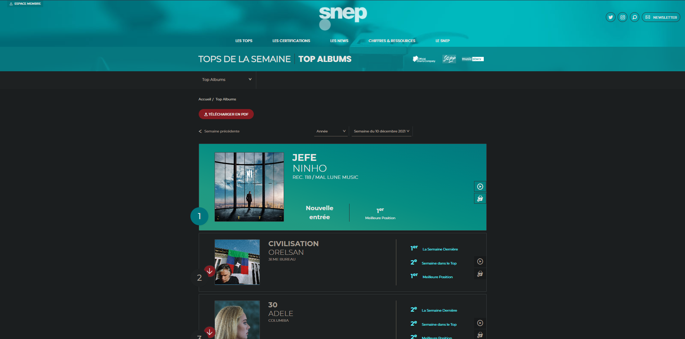
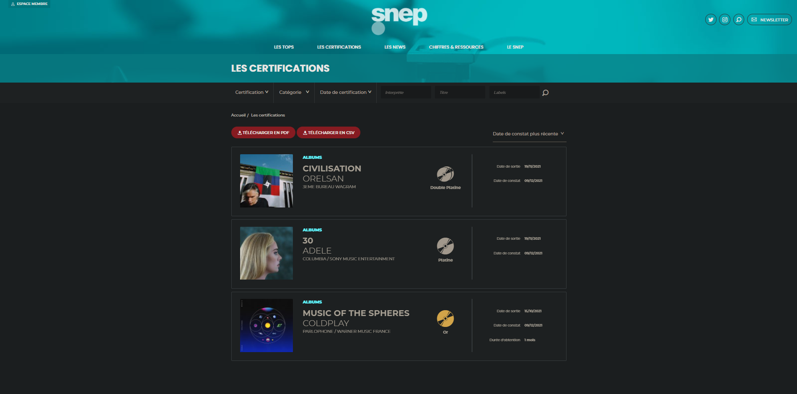
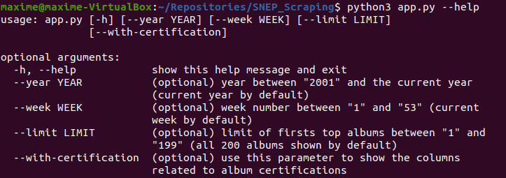
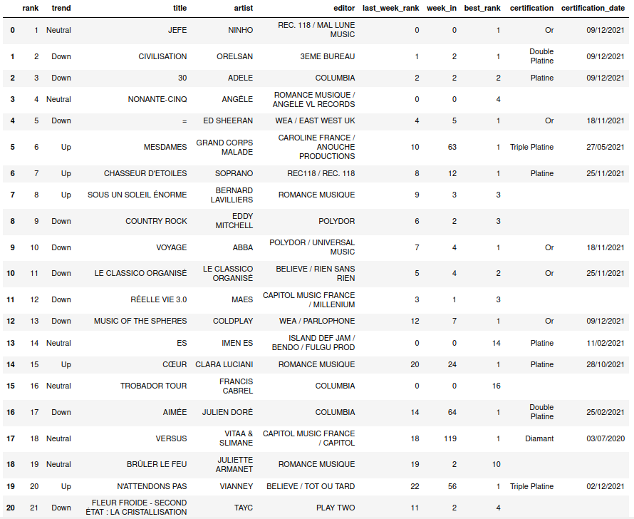
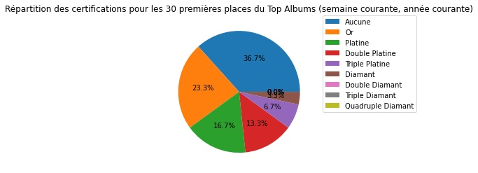

<p align="center">
    
</p>

<br>

# Projet de scraping du site du SNEP

<br>

## Sommaire
- [Le projet](#le-projet)
- [Le site du SNEP](#le-site-du-snep)
- [Le fonctionnement](#le-fonctionnement)
- [Le résultat](#le-résultat)

<br>

## Le projet

Le projet conciste a effectuer du scraping sur le site web du SNEP (Syndicat National de l'Edition Phonographique) afin de récupérer le classement français des meilleures albums de musique de la semaine courante ou d'une semaine spécifique, ainsi que les certifications liées à ces albums.

L'outil de scraping utilisé est BeautifulSoupe 4 (Python).

<br>

## Le site du SNEP

Deux URL du site du SNEP seront utilisées pour procéder au scraping :
- Top Albums hebdomadaire (https://snepmusique.com/les-tops/le-top-de-la-semaine/top-albums/)



- Certifications (https://snepmusique.com/les-certifications/)



Les données récupérées seront réunies dans un seul DataFrame (avec la librairie pandas) afin d'être analisées

<br>

## Le fonctionnement en local

Pour faire fonctionner le projet en local, exécuter le fichier app.py :

```
python3 app.py
```

Ceci aura pour effet de lancer le scraping avec les paramètres par défaut, mais il est possible de modifier 4 paramètres visibles de la manière suivante :

```
python3 app.py --help
```



Attention, le paramètre `--with-certification` augmente proportionnellement le temps de traitement par rapport à la valeur du paramètre `--limit`. En effet, cela ajoute un temps d'attente de 3s entre chaque scraping de certification d'album.

<br>

## Le fonctionnement avec Docker

Pour faire fonctionner le projet avec Docker, créer le conteneur :

```
docker-compose up --build -d
```

À la fin de la création, exécuter le fichier `app.py` (avec des paramètres facultatifs si besoin) :

```
docker exec snep_scraping_container python3 app.py
```

<br>

## Le résultat

Le résultat est généré sous forme de fichier `.csv` et `.xls` dans le dossier `results`. Voici un résultat généré le 16/12/2021 avec les paramètres `--limit 20` et `--with-certification` :



Voici un exemple d'analyse possible avec les données obtenues :



